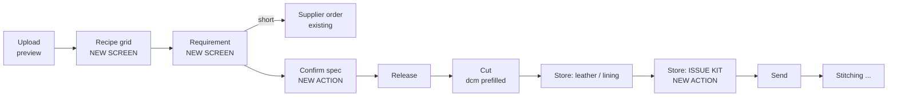

# KairoX ERP — Change Set, August 2026

**Generated:** 22 August 2026 · **Base URL:** `/api/v1` · **Auth:** Bearer JWT
**For:** backend developers (what changed and why) and frontend developers
(what to build). Companion to *Production Flow — current system*.

---

## 0 · The two things that shipped

### A · Accessory consumption and the per-piece material spec

**The problem.** The factory could only spend **leather** automatically, and even
its quantity was typed by the cutting manager on every scan. Accessories —
buttons, zips, thread — could be stocked, barcoded and received, but **nothing
ever decremented them**. So accessory stock was fiction (`on_hand` only ever went
up) and nobody at the drawer knew what a garment needed; every kit was assembled
from memory.

**The fix.** A style declares what one garment takes **before it is released**;
the store spends that recipe when it kits a drawer; and every scan — piece or
drawer — returns the checklist.

### B · Breakdown import: dictionary-free sizes, plus price and delivery

**The problem.** Sizes were recognised from a **maintained list of size names**,
which was wrong in both directions: Italian `38–62` and Japanese `LL/3L` were
silently dropped, while any stray integer header (a year, an item code) was
invented into a size. Separately, the price and ship date printed on every style
row did not survive the import at all.

**The fix.** The size band is **solved arithmetically** against the total the
sheet already prints, and price + delivery are read per style.

**Three real order sheets that previously imported as ZERO lines now import
correctly** — both BOGGI sheets and the John Peter consolidated sheets.

---

## 1 · Schema changes — there are only three

| Table | Change | Why |
|---|---|---|
| `style_material_spec` | **NEW** | the per-piece recipe: one row per material, per style, optionally per SKU |
| `piece_material_issue` | **NEW** | the consumption ledger, and the idempotency key for the kit scan |
| `drawer.accessories_in` | **NEW** boolean | the third bucket, beside `leather_in` / `lining_in` |
| `style.material_spec_confirmed_at/_by/_no_accessories` | **NEW** | the recipe header: who signed it off, and the explicit "takes none" declaration |
| `style.delivery_date` | **NEW** date | the ship date printed per style row |

Migrations: `20260821_style_spec`, `20260822_style_delivery`.
**No backfill, and none needed** — see §5.

---

## 2 · For the backend developer — the five things worth knowing

**1 · The kit is idempotent by a READ, not a constraint.**
`outstanding = qty_per_piece − already_issued`. A second tap of the scan gun
computes zero on every line, spends nothing and returns `200` with
`issued_now: []`. The unique constraint on `(piece_id, spec_line_id)` is the
*concurrency* backstop only: on a true race the loser's `IntegrityError` rolls
back its own decrement with the rest of the scan, so stock cannot go out twice.

**2 · Resolve every line before spending any of it.**
The decrement `404`s on a missing lot. Raising that halfway through a kit would
abort a scan that had already legitimately issued three good lines. So lines that
cannot be resolved come back as **data** in `unresolved[]`, the resolvable ones
still go out, and the kit reports `PARTIAL`.

**3 · Auto-RECEIVED and the RECEIVED block had to change together.**
Auto-RECEIVE used to fire the instant both cut parts were in, and any part scan
on a RECEIVED drawer was a `409`. With a kit outstanding that combination makes
the third scan impossible on every lined garment. Both halves shipped together:
auto-RECEIVE now waits for the kit, and `RECEIVED` accepts an ACCESSORY scan
(flagged `late_kit`). `SENDED` still refuses everything.

**4 · The kit gates the SEND, not line-stitching.**
Accessories are an input to *finishing*; blocking the line for a button it does
not yet need would stall production. The kit gates the drawer physically leaving
the store, which is the moment that matters. `ProductionService._merge_ok` is
deliberately untouched.

**5 · Sizes are solved, not named.**
`imports/_size_band.py` finds a column `T` and a contiguous run to its left where
`sum(run) == row[T]` for every data row. Three things the real sheets forced:
the run may **stop short** of `T` (John Peter puts the price between the band and
the total); detection must be **scoped per block** (stacked sheets declare
different sizes per block); and footer rows like `GRAND TOTAL` are **not
counter-examples**. A costing sheet reconciles too, so the band's **labels** must
also be size-shaped: short, and if numeric, under 1000.

---

## 3 · For the frontend developer — the flow to design



**Two new screens, two new actions, one changed screen.**

### 3.1 · NEW screen — the recipe grid

```
STYLE: CLERMONT                                  status: DRAFT · editable
──────────────────────────────────────────────────────────────────────────
 SCOPE  CATEGORY   SUBTYPE  ARTICLE     COLOUR  SIZE   PER PIECE   STOCK
 STYLE  LEATHER    —        SUEDE-A32   PINE    —      12.5 dcm    4 200 ✓
 STYLE  LINING     PLAIN    PL-22       BLACK   —       1.2 mtrs     380 ✓
 STYLE  ACCESSORY  BUTTON   BTN-4H      BLACK   18L        4 pcs   4 000 ✓
 STYLE  ACCESSORY  ZIP      ZIP-YKK     BLACK   60cm       1 pcs     900 ✓
 SKU    ACCESSORY  BUTTON   BTN-4H      TAN     18L        4 pcs      30 ⚠
        └─ override: CLERMONT / TAN / M
──────────────────────────────────────────────────────────────────────────
 [+ Add line] [Copy from style] [Check stock] [Confirm spec]
```

Three rules the grid must express: a row with no `sku_id` is the **style-wide
default**; a row with one **overrides** it for that colourway, keyed on
`(category, subtype, article)`; and `qty_per_piece: 0` on an override **removes**
that material for that colourway. **Never send `uom`** — it is derived and a sent
value is discarded.

### 3.2 · NEW screen — requirement and shortfall

`qty_ordered × per-piece` vs available, per line, with a suggested supplier.
Show `reserved` **separately** from `available`: nothing can currently release a
reservation, so a stuck one would otherwise look like a phantom shortfall.

### 3.3 · CHANGED screen — the store

Scan order is unchanged (**employee → drawer → piece**). What is new is a third
part and a checklist that rides *every* scan.

```
DRAWER DRW-0042 · JP-CLERMONT-PINE-M-007
────────────────────────────────────────────────────
 ✓ LEATHER   stored
 ✓ LINING    stored
 ▢ ACCESSORY KIT                       [Issue kit]
     4 × BTN-4H BLACK 18L    outstanding 4
     1 × ZIP-YKK BLACK 60cm  outstanding 1
────────────────────────────────────────────────────
 Still awaiting ACCESSORIES before it can be received.
```

- `part: "ACCESSORY"` is **explicit only** — never inferred, because a wrong
  guess spends money. Make it a button.
- The scan is **idempotent** — do not defensively disable the button; a
  double-tap is safe by construction.
- **`unresolved[]` outranks every other message.** It means the recipe asks for
  stock that does not exist under that article; no amount of scanning fixes it,
  and `next_action` says so. Show that sentence, not "awaiting accessories".

### 3.4 · The kit status, everywhere a barcode is scanned

| `kit_status` | Meaning | Render |
|---|---|---|
| `NOT_REQUIRED` | this style declares no accessories | **hide the panel** |
| `PENDING` | declared, nothing issued | checklist, all outstanding |
| `PARTIAL` | some issued, or a line will not resolve | checklist + warning |
| `ISSUED` | every line issued in full | checklist, ticked |

`NOT_REQUIRED` is the state of **every style released before this feature**.
Collapsing it into `PENDING` would show a thousand live garments an empty
accessory panel they can never satisfy.

---

## 4 · API delta — request and response

### 4.1 · NEW · the recipe — `/styles/{style_id}/material-spec`

Reads: DM, MD, HR, CUTTING / LINING / STITCHING manager, SECURITY, STORE_MANAGER.
Writes: **DM / MD only.** All writes `409` once the style is RELEASED.

| Method | Path |
|---|---|
| GET | `/styles/{id}/material-spec` |
| PUT | `/styles/{id}/material-spec` |
| POST | `/styles/{id}/material-spec/lines` |
| PATCH | `/styles/{id}/material-spec/lines/{line_id}` |
| DELETE | `/styles/{id}/material-spec/lines/{line_id}` |
| POST | `/styles/{id}/material-spec/confirm` |
| POST | `/styles/{id}/material-spec/copy-from` |
| GET | `/styles/{id}/material-spec/requirement` |

**PUT request** — saves the whole grid, idempotent on the line identity:

```jsonc
{ "lines": [
  { "sku_id": null, "category": "LEATHER", "article": "SUEDE-A32",
    "colour": "PINE GREEN", "thickness": "1.2mm", "qty_per_piece": 12.5,
    "material_lot_id": "…", "note": null },
  { "sku_id": null, "category": "ACCESSORY", "subtype": "BUTTON",
    "article": "BTN-4H", "colour": "BLACK", "size": "18L", "qty_per_piece": 4 },
  { "sku_id": "…", "category": "ACCESSORY", "subtype": "BUTTON",
    "article": "BTN-4H", "colour": "TAN", "size": "18L", "qty_per_piece": 4 }
] }
```

**GET / PUT response:**

```jsonc
{ "style_id": "…", "style_code": "JP-CLERMONT", "style_name": "CLERMONT",
  "production_status": "DRAFT", "editable": true,
  "confirmed": false, "confirmed_at": null, "confirmed_by": null,
  "no_accessories_declared": null,
  "release_blockers": ["CLERMONT's material spec has not been confirmed. …"],
  "sku_overrides_count": 1,
  "lines": [
    { "line_id": "…", "scope": "STYLE", "sku_id": null,
      "category": "ACCESSORY", "subtype": "BUTTON", "article": "BTN-4H",
      "colour": "BLACK", "thickness": null, "size": "18L",
      "qty_per_piece": 4.0, "uom": "pcs", "material_lot_id": "…",
      "note": null, "is_active": true,
      "resolution": "PINNED",          // PINNED | MATCHED | NONE | AMBIGUOUS
      "lot": { "lot_id": "…", "article": "BTN-4H", "colour": "BLACK",
               "uom": "pcs", "on_hand": 4000.0, "reserved": 0.0,
               "available": 4000.0 },
      "candidate_lot_ids": [] } ] }
```

**POST `/confirm`** — `{"no_accessories": false}` →

```jsonc
{ "style_id": "…", "confirmed": true, "confirmed_at": "…", "confirmed_by": "DM",
  "no_accessories_declared": false, "line_count": 5, "accessory_line_count": 2,
  "release_blockers": [],
  "warnings": ["No LINING line — the lining cut screen will not prefill …"],
  "message": "CLERMONT's material spec is confirmed. It may now be released." }
```

`422` if `no_accessories: true` while accessory lines exist — the two contradict,
and guessing which the DM meant is how a kit gets skipped for a whole order.

**GET `/requirement`** — each line adds `pieces`, `total_required`, `short_by`,
`suggested_supplier`; the envelope adds `qty_ordered`, `short_lines`,
`confirmed`, `release_blockers`, `message`.

**Other errors:** `422` unknown `(category, subtype)` · `422` missing `article` ·
`422` a `sku_id` from another style · `422` `qty_per_piece: 0` on a style-wide
line · `409` duplicate material on one style.

### 4.2 · NEW · off-spec correction — `POST /materials/issues`

Roles: DM, MD, **STORE_MANAGER**.

```jsonc
// request
{ "piece_barcode": "PC-004112", "lot_barcode": "LOT-ACC-000112",
  "employee_barcode": "EMP-0042", "qty": 4, "note": "spec said BLACK, gave TAN" }
// 201
{ "piece_code": "…", "article": "BTN-4H", "colour": "TAN", "qty": 4.0,
  "uom": "pcs", "source": "MANUAL", "available_after": 396.0,
  "stock_warning": null, "message": "Recorded 4 pcs of BTN-4H issued to …" }
```

This is what makes freezing the recipe at release acceptable: a released style's
recipe cannot be edited, so a wrong article is corrected by recording what was
**actually** handed over. Deliberately repeatable, and it never makes the kit
checklist think a spec line was satisfied.

### 4.3 · CHANGED · `POST /drawers/store-scan`

`part` widens to `^(LEATHER|LINING|ACCESSORY)$`. Nothing else in the request
changes, and `part` stays optional — inference is still LEATHER/LINING-only, so
an accessory issue can never happen by accident.

```jsonc
// request — the accessory scan
{ "employee_barcode": "EMP-0042", "drawer_barcode": "DRW-0042",
  "piece_barcode": "PC-004112", "part": "ACCESSORY",
  // OPTIONAL. Omit to issue the whole kit. Send it to issue part of the kit,
  // or to substitute a lot on one line.
  "lines": [ { "spec_id": "…", "qty": 4, "material_lot_id": "…" } ] }
```

```jsonc
// response — every existing field is unchanged; two keys are added
{ "…all existing fields…",
  "awaiting": ["ACCESSORIES"],   // this array may now contain ACCESSORIES
  "late_kit": false,             // kit issued into an already-RECEIVED drawer
  "kit": {                       // returned on EVERY scan, not just ACCESSORY
    "status": "ISSUED",          // NOT_REQUIRED | PENDING | PARTIAL | ISSUED
    "summary_line": "4 pcs BTN-4H BLACK 18L · 1 pcs ZIP-YKK BLACK 60cm",
    "issued_now":     [ { "spec_id": "…", "article": "BTN-4H", "colour": "BLACK",
                          "size": "18L", "qty": 4.0, "uom": "pcs",
                          "lot_id": "…", "available_after": 3996.0 } ],
    "already_issued": [], "outstanding": [], "unresolved": [],
    "stock_warnings": [], "complete": true } }
```

On a LEATHER/LINING scan the `kit` block is **read-only** — nothing is issued.
The person carrying the leather is the person who also has to find the buttons,
so the checklist gets answered on a scan they were already making.

**Backend notes.** Order of gates is unchanged where it matters: the wrong-drawer
`409` is still the first business check, before anything accessory-aware, so a
mis-scan can never move stock. `RECEIVED` still `409`s for LEATHER/LINING but is
**allowed** for ACCESSORY (`late_kit: true`) — an accessory issue is purely
additive and cannot revoke a gate the drawer already passed. The whole scan is
one transaction and one commit; any raise unrolls the decrements with it.

### 4.4 · CHANGED · `GET /barcode/resolve`

**Zero schema change** — `piece` and `drawer` were already free-form objects.
Both gain `material_requirement`; the drawer also gains `accessories_in` and
`kit_required`.

```jsonc
"material_requirement": {
  "kit_status": "PENDING", "kit_required": true, "spec_confirmed": true,
  "summary_line": "4 pcs BTN-4H BLACK 18L · 1 pcs ZIP-YKK BLACK 60cm",
  "leather": { "article": "SUEDE-A32", "colour": "PINE GREEN",
               "thickness": "1.2mm", "qty_per_piece": 12.5, "uom": "dcm",
               "lot_id": "…", "available": 4200.0,
               "resolution": "MATCHED", "consumed": 14.0 },
  "lining": { "…same shape…" },
  "accessories": [
    { "spec_id": "…", "scope": "STYLE", "subtype": "BUTTON", "article": "BTN-4H",
      "colour": "BLACK", "size": "18L", "qty_per_piece": 4.0, "uom": "pcs",
      "issued_qty": 0.0, "outstanding": 4.0, "lot_id": "…",
      "available": 4000.0, "resolution": "MATCHED", "short": false } ] }
```

`leather.qty_per_piece` is what the recipe says; `leather.consumed` is what the
cut actually recorded. **The two differing is normal** — it is the first thing
a costing question asks about, so both are shown rather than reconciled away.

### 4.5 · CHANGED · `POST /production/log` and `GET /production/piece-state`

Request gains one optional field inside `consumption`:

```jsonc
"consumption": { "dcm": 14.0, "use_style_spec": false }
```

`use_style_spec: true` lets the server fall back to the recipe's LEATHER line
when `dcm` is omitted. It is **opt-in**: a client that omits both still gets
today's `422`, so the guard that protects the leather ledger and the costing is
untouched. If the pieces in one batch resolve to different spec values, `422`
naming them and asking the caller to send `dcm` or split the batch.

```jsonc
// response — two added fields
"consumption_source": "typed",        // "typed" | "style_spec" | null
"kit_by_piece": {                     // deliberately lean: a 40-piece batch
  "PC-004112": { "kit_required": true, "kit_status": "PENDING",
                 "outstanding": 5.0 } }
```

Two batched queries populate `kit_by_piece` — spec lines for the batch's styles,
issue counts for its pieces — so it costs the same on 1 piece or 40. It is
populated on `preview` too, because a preview is a read.

`GET /production/piece-state` gains `suggested_dcm_per_piece` and the full
`material_requirement` block from §4.4.

### 4.6 · CHANGED · `POST /imports/breakdown/{order}/release`

**Request unchanged.** `rejected[]` entries keep their existing shape and gain
`blockers[]`:

```jsonc
{ "style_id": "…", "style_code": "JP-CLERMONT",
  "reason": "CLERMONT cannot be released yet. CLERMONT's material spec has not been confirmed. …",
  "blockers": [ "CLERMONT's material spec has not been confirmed. …",
                "CLERMONT has no LEATHER line — nobody has entered the dcm per piece." ] }
```

Partial accept is preserved: one unconfirmed style does not stop the others in
the order from releasing, and a rejected style mints **zero** pieces, zero
barcodes and zero drawers. The check runs in the existing async validation loop
before the sync mint, not inside it.

Blocker rule, in full:

| Condition | Blocker |
|---|---|
| `material_spec_confirmed_at IS NULL` | spec not confirmed |
| no active LEATHER line | no dcm per piece |
| no active ACCESSORY line **and** `no_accessories` is not `true` | nobody declared it needs none |

A missing LINING line is a **warning**, not a blocker — it matches the existing
optional-lining rule.

### 4.7 · CHANGED · `POST /imports/preview`

Same request. Each style block gains three fields, and each size row gains one:

```jsonc
{ "style": "CLERMONT", "article": "8014",
  "unit_price": "80.00", "currency": "EUR",     // NEW
  "delivery_date": "2026-10-15",                // NEW
  "size_confidence": "HIGH",                    // NEW: HIGH | MEDIUM
  "colours": [ { "colour": "BLACK",
                 "sizes": { "S": 10, "M": 20, "XXL/54": 4 },
                 "total": 34 } ] }
```

`size_confidence` is the only new field worth a UI decision:

- **HIGH** — a printed TOTAL column was found and every data row reconciles
  against it. Import silently.
- **MEDIUM** — no printed total existed, so the size band was taken from the
  header shape alone. Show the parsed sizes and ask for a glance before commit.

There is **no LOW.** A band that cannot be confirmed is not returned as a guess —
the block is skipped with a warning, because a wrong size band mints wrong
barcodes for a whole order.

Sizes arrive **verbatim**: trimmed and upper-cased, nothing else. `"XL "`, `"xl"`
and `"XL"` are one size; `"XXL/54"` stays `"XXL/54"`. No size dictionary exists
anywhere in the importer any more, which is what makes it work on a brand nobody
has seen yet.

`POST /imports/commit` writes `unit_price` + `currency` + `delivery_date` onto
`Style`. Conflicts across rows: **price keeps the first and warns**; **delivery
keeps the earliest and warns**. Both warnings name the style and both values.

---

## 5 · Nothing you have today breaks

| Surface | Verdict |
|---|---|
| `GET /barcode/resolve` | **No schema change.** Both payloads gained one key; none removed. Machine-checked — a test asserts the pre-existing key set is a subset of the new one. |
| `POST /drawers/store-scan` | +2 optional response fields, +1 optional request field. The `part` pattern only *widens*. |
| `GET /drawers` · `GET /drawers/{id}` | +`accessories_in`, +`kit_required` — booleans, default false. |
| `POST /production/log` | +2 optional response fields, +1 optional request field. `dcm` behaviour is byte-identical unless `use_style_spec` is sent. |
| `POST /imports/breakdown/{order}/release` | Request untouched; `rejected[]` keeps its shape and gains a key. |
| `POST /imports/preview` · `/commit` | +3 style fields, +1 row field. Existing keys unchanged. |
| `/materials/*` lots, receipts, suppliers | Unchanged. `decrement_for_cut_nocommit` keeps its exact signature, return type and message. |
| `ClientOrder.delivery_deadline` | **Untouched.** The new date lives on `Style.delivery_date`. |
| Styles already in production | Unchanged in every respect. |

**Why styles already on the floor are unaffected, by construction.** A released
style has no recipe lines, so `kit_required` is false, so the completeness rule

```
complete = leather_in AND (lining_in OR NOT needs_lining)
                      AND (accessories_in OR NOT kit_required)
```

collapses to exactly the two clauses it had before. Every drawer, every
auto-RECEIVED transition and every send behaves identically. That is asserted
over the whole truth table in `tests/unit/test_kit_rules_pure.py`, not merely
intended. The release gate is likewise never re-evaluated: `release_styles`
rejects non-DRAFT styles *before* the spec check would run.

Two migrations, **no backfill**: a NULL `material_spec_confirmed_at` is the
load-bearing "nobody has been asked yet" state, exactly like `Style.needs_lining`.

---

## 6 · How this was verified

```bash
pytest tests/ -v                    # 1144 passed
python verify/run_logic_checks.py   # pure logic, no deps
```

**118 new tests** across the five layers, money-paths first:

| Layer | File | Proves |
|---|---|---|
| Unit | `tests/unit/test_kit_rules_pure.py` | the completeness truth table, including the 8 pre-existing rows unchanged |
| Unit | `tests/unit/test_size_band_and_money.py` | `to_money` over symbols, European decimals, incoterms; size detection against a decoy numeric column |
| Integration | `tests/integration/test_accessory_issue.py` | single decrement · **double scan is a no-op** · shortfall warns · partial accept · atomicity · `late_kit` on a RECEIVED drawer · wrong drawer 409s *before* any stock moves |
| Integration | `tests/integration/test_style_material_spec.py` | `PUT` idempotency, duplicate-with-NULL-colour 409, writes on a RELEASED style 409 |
| Integration | `tests/integration/test_release_gate_material_spec.py` | unconfirmed → `rejected[]` with **zero pieces minted**; partial accept across styles |
| Integration | `tests/integration/test_order_price_delivery_load.py` | price first-wins, delivery earliest-wins, currency fallback chain |
| Functional | `tests/functional/test_garment_with_accessories.py` | one garment, spec → confirm → release → cut → store → **kit** → send → export → drawer recycles with all three booleans false |
| Functional | `tests/functional/test_order_sheet_golden.py` | golden-file parse of all three named fixtures |
| System | `tests/system/test_style_spec_endpoints.py` | role guards per route; the `/barcode/resolve` additivity contract |

**The importer was regression-checked against every legacy client sheet** — the
piece totals reconcile exactly as before the rewrite: KJ 347 · GGZ 146 ·
NIPAL 259 · RICANO 150 · John Peter 2263 · NIPAL-NEW 393. Three named fixtures
parse HIGH confidence: BOGGI MAIN (S–XXXL, 795 pcs), BOGGI OUTLET (S–XXL,
620 pcs, `80.00 EUR` read from `"€ 80,00 cif"`), John Peter (38–62, 1273 pcs).

A costing sheet that reconciles 33 rows of *money* is correctly **not** read as
a size band — sizes are bounded by shape (≤8 chars, no decimal separator, numeric
value <1000), so a column headed `576000 | 0.05 | 28800` cannot be mistaken for
one.

Both migrations were rendered offline (`alembic upgrade X:Y --sql`) to catch the
Postgres 63-character identifier limit before it reached a database — one FK name
came out at 66 characters and the column was renamed. **They still need one real
Postgres run before deploy**; the test suite builds its schema with
`create_all`, so SQLite never exercises the migration path.

---

## 7 · Known limits, stated plainly

- **`.xls` (the old binary format) cannot be read** — openpyxl is `.xlsx`-only.
  This affects the Confecciones sheets and most CONFEZIONI ORFATTI sheets. It
  predates this work; the fix is a re-save as `.xlsx`, or adding `xlrd`.
- **Formula totals need a cached value.** A `=SUM()` written by a script has no
  cached result, so the sheet parses MEDIUM instead of HIGH. Files saved by
  Excel itself always carry the cached value and parse HIGH. The template ships
  with literal totals for this reason.
- **A wrong recipe on a released style is frozen.** Correct it on the floor with
  `POST /materials/issues` (`source=MANUAL`), which records what was actually
  handed over. A DM-only force-confirm can be added if the factory asks.
- **Reservations are reported, never created.** `requirement` shows `reserved`
  beside `available`, but this feature does not reserve stock: nothing in the
  system can currently *release* a `MaterialReservation`, and creating one would
  permanently wedge `adjust_lot` and `retire_lot`. Separate ticket.
- **Line-stitching is deliberately not gated on the kit.** Accessories are an
  input to finishing, not to stitching. The kit gates the **send** — the garment
  physically leaving the store — which is the moment that matters.
