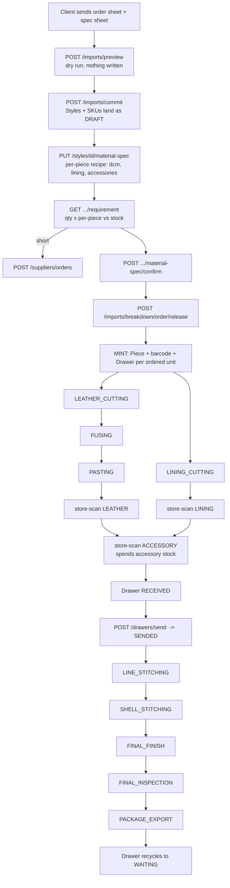

# KairoX ERP — Production Flow (current system)

**As of:** 22 August 2026 · **Base URL:** `/api/v1` · **200 endpoints across 17 modules**
**Scope:** Phase 1 — order intake through export, plus attendance, wages and analytics.
Phase-2 procurement (BOM auto-generation) is listed but not detailed here.

---

## 1 · What the system is for

A production-management ERP for a **leather garment factory**, whose defining
capability is **per-piece traceability**: every individual garment carries a
barcode from the moment its style is released, and every action taken on it —
cut, stored, kitted, stitched, inspected, exported — is scanned and logged
against that barcode, by a named worker, on a dated shift.

Everything else in the system exists to feed or read that spine.

---

## 2 · Who does what

| Role | Value | What they do on the floor |
|---|---|---|
| Managing Director | `managing_director` | Superuser. Finalises costing. Bypasses stage gates |
| Direct Manager | `direct_manager` | Designer. Uploads breakdown, enters the material spec, releases styles, sends drawers. Bypasses stage gates |
| Cutting Manager | `cutting_manager` | Logs leather cutting only. Creates material lots |
| Lining Manager | `lining_manager` | Logs the lining-cut path |
| Stitching Manager | `stitching_manager` | Logs every post-cut floor stage |
| Store Manager | `store_manager` | Runs the store hub: store scans, kit issue, sends |
| Supervisor | `supervisor` | Reads the floor roster |
| HR | `hr` | Employees, wages, attendance operator |
| Security | `security` | Gate operator — scans employee cards in and out |
| Client / Viewer | `client` / `viewer` | Read-only |

**Shop-floor workers have no login.** A worker has no `app_user` row at all. They
are identified by an **employee barcode**, and their attendance is entered *for*
them by an operator (SECURITY / HR / MD / DM). `UserRole.login_roles()` is the
authority on who may hold a login, and `UserService._reject_non_login_role` is
the single choke point that enforces it.

---

## 3 · The data hierarchy

```
Client
 └── ClientOrder              order_number, delivery_deadline
      └── Style               name, article, unit_price, currency, delivery_date,
           │                  needs_lining, production_status, material_spec_*
           ├── StyleMaterialSpec[]     the per-piece recipe (dcm, lining, accessories)
           └── SKU            colour + size + qty_ordered
                └── Piece     ONE physical garment. seq 1..N within the SKU
                              code == its barcode. needs_lining, drawer_id
```

**`Piece` is the tracked unit.** Its `code` *is* the parent barcode. Pieces are
minted at **style release**, not at cutting — a garment has an identity and a
drawer before it is ever cut.

---

## 4 · The end-to-end flow



---

## 5 · Stage 0 — materials

Three categories, one flow: **Leather**, **Lining**, **Accessories**.

- **Stock check** — `GET /materials/stock` returns **on-hand / reserved /
  available**, where `available = on_hand − reserved`. `available` is **derived,
  never stored**, so the two can never drift.
- **Add a lot** — `POST /materials/lots`. Strict per-category fields (`GET
  /materials/spec` returns the field list at runtime so the UI renders the right
  form). Creating a lot **mints a child barcode** — that is how material formally
  enters inventory. One lot per material spec; a duplicate is a 409 pointing at
  the existing lot.
- **Order and receive** — `POST /suppliers/orders` (ORDERED → ARRIVED), then
  `POST /materials/receive` records **approved** and **rejected** quantities
  separately. Approved adds stock; rejected is logged for supplier quality
  history.

| Category / subtype | Required fields | Quantity (uom) |
|---|---|---|
| Leather | thickness, dcm | dcm |
| Lining / plain | thickness, mtrs | mtrs |
| Lining / ribs | kg | kg |
| Lining / knit | pcs | pcs |
| Accessory / button, zip | size, count | pcs |
| Accessory / thread | thickness, mtrs | mtrs |
| Accessory / other | description, count | pcs |

---

## 6 · Order intake — from spreadsheet to DRAFT

`POST /imports/preview` parses and validates without writing anything;
`POST /imports/commit` writes Styles, SKUs and order lines. Both DM only.

**Sizes are detected arithmetically, not from a word list.** The importer finds a
column `T` and a contiguous run of quantity columns to its left where
`sum(run) == row[T]` for every data row — that run *is* the size band, whatever
the columns are called. So `S..XXXL`, Italian `38..62`, Japanese `LL/3L` and a
combined `XXL/54` all import with the same code and no configuration.

The importer also reads **unit price** and **delivery date** per style row.

Commit writes styles as **DRAFT**: nothing is minted, no drawers consumed, and
the style is invisible to every floor count. `style_in_production()` — a single
shared SQL predicate — is the one definition of "in production", so no query can
disagree about what counts.

---

## 7 · The material spec — the per-piece recipe

Before a style may be released, someone has to say what one garment of it takes.

```
STYLE: CLERMONT
  LEATHER    SUEDE-A32 · PINE · 1.2mm     12.5 dcm / piece
  LINING     PL-22 · BLACK                 1.2 mtrs / piece
  BUTTON     BTN-4H · BLACK · 18L            4 pcs / piece
  ZIP        ZIP-YKK · BLACK · 60cm          1 pcs / piece
  + override: the TAN colourway takes TAN buttons
```

- Lines are **per style**, with optional **per-SKU overrides** keyed on
  `(category, subtype, article)`. `qty_per_piece: 0` on an override removes that
  material for that colourway.
- The six identity columns are deliberately the same six as a material lot's, so
  a recipe line resolves to physical stock through the existing lot matcher.
- `GET .../requirement` projects `qty_ordered × per-piece` against available
  stock and suggests a supplier for each shortfall.
- `POST .../confirm` is the sign-off that unlocks release, and it is audited.
- The recipe **freezes at release**, because from then on it is being spent.

---

## 8 · Release — the mint

`POST /imports/breakdown/{order_number}/release` is the **only** path that mints.

It validates each style with **partial accept** — one unspecced style must never
lose the four the DM ticked with it — and rejects a style that is not DRAFT, has
no ordered quantity, or fails the material-spec gate:

- its spec has not been confirmed, or
- it has no LEATHER line (the dcm is what the ledger and costing are built on), or
- it names no accessories and nobody declared `no_accessories: true`.

For every releasable style the mint runs **atomically** in one transaction and
creates, per ordered unit: the **Piece**, its **parent barcode**, a **Drawer**,
and the **drawer barcode**. It stamps `needs_lining` from the DM's declaration
and merges each piece to its drawer. It is **idempotent** — re-running tops up,
never duplicates.

The drawer pool is **finite**. If released pieces outrun free drawers, the
remainder are minted **without** a drawer and reported as
`pieces_waiting_for_drawer`. They have identities but cannot be stored, and
therefore cannot pass the merge gate, until a drawer frees or DM/MD grows the
pool (`POST /drawers/pool`). A deliberate, visible stall rather than a silent
unbounded pool.

---

## 9 · The barcode system

`BarcodeRegistry` is the single table every scan resolves through.
`GET /barcode/resolve?code=` is one indexed lookup:

- unknown code → **404**
- retired employee card → **410 Gone** (distinct from "never existed")
- otherwise → the code's `type` plus a live payload

| Type | Minted when | Editable? |
|---|---|---|
| `PIECE` | style release | No — permanent garment identity |
| `LEATHER_LOT` / `LINING_LOT` / `ACCESSORY_LOT` | material lot created | No |
| `DRAWER` | style release (one per piece) | No — static code, recycling state |
| `EMPLOYEE` | employee created | **Yes** — reissue / deactivate |

**Employee barcode lifecycle is history-safe.** Reissue retires the old code and
mints a new one. Deactivate flips the registry status to RETIRED so `resolve`
returns 410 — **the employee row, every production event and every wage line stay
intact.** You delete the scannable code, never the person or their record.

---

## 10 · Production logging — one endpoint, two doors, no stage buttons

`POST /production/log` is the whole floor's logging surface. The caller sends an
**actor** (employee, by barcode or id) and **targets** (pieces, by barcode or
sku+seqs). **The caller never sends a stage:**

- a **cut screen** (`LEATHER_CUT` / `LINING_CUT`) fixes the cut stage
- otherwise the stage is **inferred** from each piece's own history

The barcode door and the manual door post the same shape; the router resolves
barcodes to ids, and the service sees ids only. `preview: true` runs every gate
and returns the exact result buckets **without writing anything**.

### The pipeline

```
LEATHER_CUTTING ┐
                ├─ parallel cut paths, per piece
LINING_CUTTING  ┘
   → FUSING → PASTING → [MERGE GATE] → LINE_STITCHING → SHELL_STITCHING
   → FINAL_FINISH → FINAL_INSPECTION → PACKAGE_EXPORT
```

### The four gates — cheapest and most-likely-to-fail first

| # | Gate | Scope | Effect |
|---|---|---|---|
| 1 | **ROLE** — may this manager's role log this stage? | whole request | **403** — but a MIXED batch with at least one permitted stage degrades to per-piece |
| 2 | **SKILL** — may this employee's designation work this stage? | per piece | **warning only**; the work still logs |
| 3 | **SEQUENCE** — has the piece completed the previous chain stage? | per piece | `sequence_blocked` |
| 4 | **MERGE** — is the piece's drawer SENDED? (LINE_STITCHING only) | per piece | `merge_blocked` |

Gate 1 is whole-request because the *role* is wrong for the whole batch. Gates
2–4 are per-piece so **one bad piece never loses the good ones a manager scanned
with it**. MD/DM/HR bypass the role gate.

Every rejection returns `{piece, stage, gate, reason}` — a bare code with no
cause is not actionable on a factory floor.

### Consumption at cutting

The **two cut stages only** capture material consumption. One event is written
per piece, each carrying the per-piece quantity and the lot; then **one** stock
decrement of `qty × fresh_cut_count` runs in the *same transaction*. A hide cut
but not deducted overstates stock; a deduction with no event understates output.

The lot link lives on the **event** — the act of cutting — never on the piece.
Shortfalls **warn, never block**: the garment is physically on the table, and
refusing the log to protect a number would lose the production record.

---

## 11 · The store — drawers, the merge gate and the kit

A drawer is a physical slot with a **static code** and a **recycling state**:

```
WAITING → MERGED (at release) → HOLDING_LEATHER / HOLDING_LINING
        → HOLDING_BOTH → RECEIVED → SENDED → (piece ships) → WAITING
```

**Store scan order is employee → drawer → piece.** The merge map is the
authority: a piece scanned into the wrong drawer is a **409**, not a
re-assignment. The part (LEATHER / LINING) is **inferred** from the piece's
history and the drawer's contents — there is no Hold Leather / Hold Lining
button, because a hand-picked bucket is only ever a chance to pick the wrong one.

**The accessory kit is the third bucket** and is **never inferred** — it is an
explicit `part: "ACCESSORY"` scan, because a mis-inferred kit would *spend stock*
nobody asked to spend. Issuing it decrements every accessory lot on the style's
recipe, writes a ledger row per line, and is **idempotent**: a second tap issues
nothing.

**Completeness, not sequence**, governs the drawer:

```
complete = leather_in
       AND (lining_in     OR NOT needs_lining)
       AND (accessories_in OR NOT kit_required)
```

- **RECEIVED** advances automatically once both cut parts are physically in *and*
  the kit is satisfied.
- **SENDED** is manual (`POST /drawers/send`) and is the judgement that opens the
  merge gate. An unkitted drawer **cannot leave the store**.
- At `PACKAGE_EXPORT` the drawer **recycles** to WAITING with all three buckets
  cleared.

The lining requirement is resolved through `core/lining_rules`, not the stored
`piece.needs_lining` flag — that flag is written once at mint and is known to be
wrong for 925 of 1,425 pieces in one live order.

---

## 12 · Attendance

**Every attendance write comes from an operator login — SECURITY / HR / MD / DM.**
Nobody else can punch, because nobody else on the floor has a login.

- **Barcode door (primary)** — `POST /attendance/scan-check-in`: the operator
  resolves the worker's card and the server calls the same open/close primitives
  the manual flow uses, so both doors share one geofence, one late/short rule and
  one idempotent re-tap.
- **Manual door (fallback)** — `POST /attendance/proxy/check-in|check-out` when a
  card fails or is forgotten.
- `POST /attendance/check-in|check-out` is an operator recording **their own**
  arrival.

`work_date` uniqueness is enforced at the DB level and check-in is idempotent —
a re-tap is a no-op, not an error. **Production logging requires the employee to
be present today.**

---

## 13 · Wages

- **One line per employee per run.** PIECE_RATE and MONTHLY are mutually
  exclusive — never both.
- Rates are **date-effective**: a mid-period rate change prices each day at the
  rate effective that day.
- Runs support **recomputation with a full audit trail**, and may be scoped to
  one order or one style — the scope is stored on the run so a recompute
  reproduces the same scope rather than silently widening it.
- **A closed run is a frozen snapshot.** The only way to change it is an explicit,
  audited **reopen** that captures a reason, counted separately from recomputes
  because "recomputed twice" and "unfrozen twice after payment" are different
  facts about a payslip.
- Visible only to **HR / DM / MD**.

---

## 14 · Analytics and dashboards

Read-only. Analytics **owns no tables and never writes**.

- Factory overview, order/style explorer, stage spread, freight-risk alerts
- **Piece life story** — every stage a piece passed, who, when, rework flag,
  leather consumed at cutting, current stage and what it is waiting on
- **Consumption vs stock** — leather consumed per style, summed from cut events
- Role dashboards: cutting, lining, stitching, store, direct-manager

Analytics is a **live** view; payroll of record stays the frozen wage run. The
two legitimately differ mid-period, and that is not a bug.

---

## 15 · Module map

| Module | Owns | Endpoints |
|---|---|---|
| `users` / `auth` | logins, JWT, roles | 6 |
| `employees` | workers, designations, barcodes | 5 |
| `attendance` | the two doors, geofence, config | 12 |
| `clients` | Client → Order → Style → SKU | 8 |
| `imports` | preview, commit, breakdown edit, **release** | 9 |
| `materials` | lots, stock, receive, **style spec**, issues | 21 |
| `barcode` | the registry, `resolve`, print | 10 |
| `production` | the two-door log, gates, piece-state | 9 |
| `drawers` | store scan, merge gate, kit, send, pool | 9 |
| `wages` | rates, runs, ledger, close/reopen | 15 |
| `analytics` / `dashboard` | read-only views | 32 |
| `procurement` / `bom` / `inventory` / `supplier_po` | **Phase 2** — BOM pipeline | 62 |

---

## 16 · Invariants — the rules that must not be broken

1. **Repository = all DB access. Service = business logic. Router = HTTP only.**
   Commits belong in the service, batching a whole scan into one transaction.
2. **Approval gates are hard, audited state transitions** — never soft booleans.
3. **The breakdown sheet is the production source of truth**; production events
   reference it, not the raw spec.
4. **Designations are UPPERCASE**, names are unique, wages are one line per
   employee per run, closed runs are frozen.
5. **Partial accept everywhere** — one bad item never loses the good ones.
6. **Warn, never block, on stock shortfalls** — the work physically happened.
7. **Sizes are stored verbatim** from the client's sheet, case-folded only, so
   the printed label and the database never disagree.
8. **Phase-1 manual paths converge with Phase-2 auto-generation on ONE contract.**
   The BOM will write the material spec through the same service, the same
   validation and the same confirm gate.
